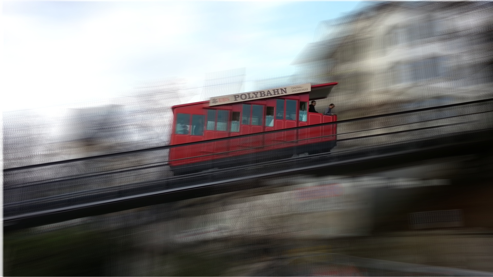

# lets - A long exposure time simulation library

## Requirements

* OpenCV >= 3.4 [https://opencv.org/](https://opencv.org/)

## How to compile the code?

1. Git clone repository
2. mkdir `build` && cd build
3. cmake .. && make -j4

## How to make a long exposure time image from a video?
./VideoProcessing <path-to-video-file>

## Result

Image depicts the result of a 120 frames long video.
